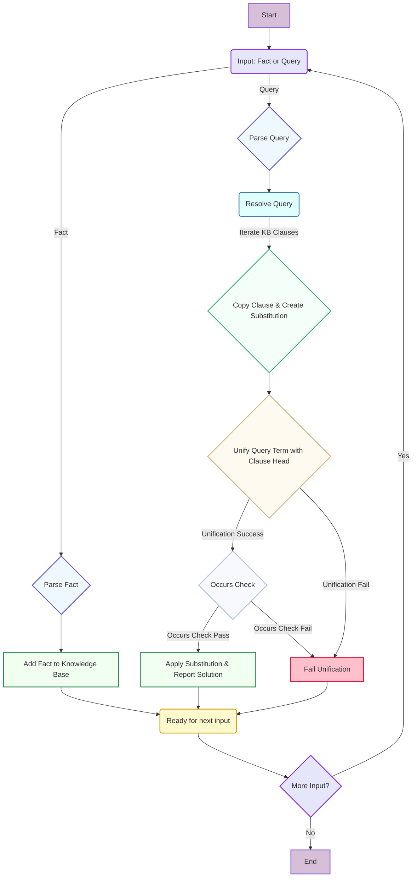

# ☕️ Prolog Interpreter Demo

Welcome to the Prolog Interpreter Demo! This project showcases a basic Prolog-like inference engine implemented in C. It's designed to be modular, extensible, and easy to understand.

## ✨ Features

- **Term Management**: Create, copy, and free atoms, variables, and compound terms.
- **Clause Handling**: Define and manage facts (simple clauses).
- **Knowledge Base**: Store and retrieve clauses efficiently.
- **Substitution**: Apply and manage variable substitutions during unification.
- **Parsing**: A simple parser for facts and queries.
- **Unification**: Core logic for pattern matching with occurs check.
- **Inference Engine**: Resolves basic queries against the knowledge base.
- **Interactive Mode**: Interact with the interpreter directly.
- **File Input**: Load facts and queries from a file.
- **Modular Design**: Code is split into logical units for clarity and maintainability.
- **Outstanding Makefile UX**: Easy build, run, test, and clean operations with colorized output.

## 🏗️ Project Structure (ASCII Diagram)

The project is organized into modular components, making it easier to navigate and extend.

```text
.
├── Makefile
├── main.c
├── term.h
├── term.c
├── clause.h
├── clause.c
├── knowledge_base.h
├── knowledge_base.c
├── substitution.h
├── substitution.c
├── parser.h
├── parser.c
├── unification.h
├── unification.c
├── inference.h
├── inference.c
├── input.txt
└── input_unification.txt
```

## 🚀 How It Works (Mermaid Flowchart)

The following diagram illustrates the high-level flow of how the Prolog interpreter processes input and resolves queries.



## 🛠️ Building the Project

The `Makefile` simplifies the build process. Navigate to the `demo` directory and use `make`.

```bash
cd demo
make
```

### Makefile Targets

- `make all`: Compiles all source files and links them into the `prolog` executable.
- `make run`: Executes the compiled `prolog` interpreter in interactive mode.
- `make test`: Runs predefined tests using `input.txt` and `input_unification.txt`.
- `make clean`: Removes all compiled object files (`.o`) and the `prolog` executable.
- `make help`: Displays a detailed help message with all available targets.

## 🏃 Running the Interpreter

### Interactive Mode

To run the interpreter in interactive mode:

```bash
cd demo
make run
```

You can then enter facts (e.g., `parent(john, mary).`) and queries (e.g., `?- parent(john, X).`). Type `exit.` to quit.

### File Input

To load facts and queries from a file:

```bash
cd demo
./prolog input.txt
```

Example `input.txt` content:
```prolog
parent(john, mary).
parent(mary, peter).
?- parent(john, X).
?- parent(X, Y).
?- parent(peter, Z).
```

## 🧪 Testing

The `make test` command will run the interpreter with two predefined input files:

```bash
cd demo
make test
```

This will demonstrate basic fact assertion and query resolution, including unification with variables and occurs check.

## 🎨 Color Palette (Conceptual)

While direct control over Markdown rendering colors is limited, the intended aesthetic for code blocks and diagrams is a professional and pleasant pastel theme:

- **Backgrounds**: Soft, light pastels (e.g., `Lavender`, `AliceBlue`, `MintCream`).
- **Text/Lines**: Contrasting darker, muted tones (e.g., `SlateBlue`, `DarkGreen`, `CadetBlue`).
- **Highlights/Accents**: Slightly brighter pastels for emphasis (e.g., `LightCoral`, `LightSkyBlue`).

The Mermaid diagram above uses inline styling to approximate this conceptual color palette.

## 🔮 Future Enhancements

- **Rules**: Implement support for Prolog rules (e.g., `grandparent(X, Y) :- parent(X, Z), parent(Z, Y).`).
- **Backtracking**: Introduce a proper backtracking mechanism for finding all solutions to a query.
- **Operator Precedence**: Enhance the parser to handle more complex Prolog syntax with operator precedence.
- **Built-in Predicates**: Add support for common built-in predicates (e.g., `write/1`, arithmetic operations).
- **Error Handling**: More robust error reporting and recovery.
- **Variable Renaming**: Implement safe variable renaming for clauses during resolution to prevent clashes.

This project serves as a solid foundation for building a more complete Prolog interpreter. Contributions and suggestions are welcome!
