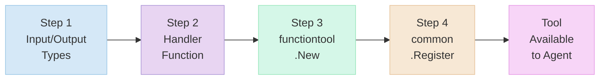
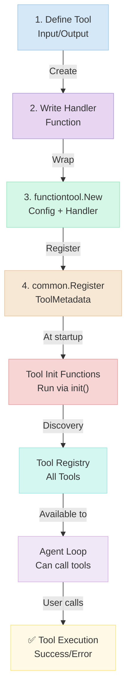

# Tool Development Guide

## Quick Start: Create Your First Tool in 5 Minutes

This guide teaches you the **4-step pattern** for building tools in adk-code.

---

## 1. The Tool Pattern (4 Steps)

Every tool follows this exact structure:



The workflow:
1. **Define** input/output structures with JSON schema
2. **Implement** the handler function with business logic
3. **Wrap** the handler with `functiontool.New()`
4. **Register** the tool with `common.Register()` in an `init()` function

---

## 2. Step-by-Step: Complete Example

### Example: Create a "Count Lines" Tool

#### Step 1: Define Input/Output Types

Create file: `tools/analysis/count_lines_tool.go`

```go
package analysis

import (
	"google.golang.org/adk/tool"
	"google.golang.org/adk/tool/functiontool"

	"adk-code/tools/base"
)

// CountLinesInput defines the input for counting lines in a file
type CountLinesInput struct {
	// Path is the file to analyze
	Path string `json:"path" jsonschema:"Path to the file to analyze"`

	// OnlyNonEmpty counts only non-empty lines (optional)
	OnlyNonEmpty *bool `json:"only_non_empty,omitempty" jsonschema:"Count only non-empty lines (default: false)"`
}

// CountLinesOutput defines the result of counting lines
type CountLinesOutput struct {
	Success       bool   `json:"success"`
	TotalLines    int    `json:"total_lines"`
	NonEmptyLines int    `json:"non_empty_lines"`
	Message       string `json:"message,omitempty"`
	Error         string `json:"error,omitempty"`
}
```

**Key Points**:

- JSON tags for input/output marshaling
- jsonschema tags for LLM prompt generation
- Optional fields use `*type` with `omitempty`
- Output always includes `Success` and `Error` fields

#### Step 2: Create Handler Function

Continue in the same file:

```go
// Handler is the business logic
func countLinesHandler(ctx tool.Context, input CountLinesInput) CountLinesOutput {
	// Read file
	content, err := os.ReadFile(input.Path)
	if err != nil {
		return CountLinesOutput{
			Success: false,
			Error:   fmt.Sprintf("Failed to read file: %v", err),
		}
	}

	// Count lines
	lines := strings.Split(string(content), "\n")
	totalLines := len(lines)

	nonEmptyLines := 0
	if input.OnlyNonEmpty != nil && *input.OnlyNonEmpty {
		for _, line := range lines {
			if strings.TrimSpace(line) != "" {
				nonEmptyLines++
			}
		}
	} else {
		nonEmptyLines = totalLines
	}

	return CountLinesOutput{
		Success:       true,
		TotalLines:    totalLines,
		NonEmptyLines: nonEmptyLines,
		Message:       fmt.Sprintf("%s has %d lines", input.Path, totalLines),
	}
}
```

**Handler Best Practices**:

- Never panic (return error in output struct)
- Use descriptive error messages
- Validate input early
- Return partial results if possible (not all-or-nothing)

#### Step 3: Tool Creation with functiontool.New

Still in the same file, create the factory function:

```go
// NewCountLinesTool creates a tool for analyzing line counts
func NewCountLinesTool() (tool.Tool, error) {
	t, err := functiontool.New(
		functiontool.Config{
			Name:        "count_lines",
			Description: "Counts the number of lines in a file. Useful for quickly understanding file size or validating file structure.",
		},
		countLinesHandler,
	)

	if err != nil {
		return nil, err
	}

	return t, nil
}

// init() automatically registers the tool
func init() {
	tool, err := NewCountLinesTool()
	if err != nil {
		// Tool registration failed, but don't panic
		return
	}

	common.Register(common.ToolMetadata{
		Tool:      tool,
		Category:  common.CategoryAnalysis,  // or existing category
		Priority:  2,
		UsageHint: "Quick file analysis without loading entire content",
	})
}
```

**Key Considerations**:

- `functiontool.Config.Name`: Used in CLI (must be lowercase, snake_case)
- `functiontool.Config.Description`: Shown in `/help` and to LLM
- `Priority`: 1 (highest) for common tools, 2+ for specialized
- `UsageHint`: Brief tip for when to use this tool

**Tool Registration Flow**:



#### Step 4: Register in tools/tools.go

Add to the exports at the top of `tools/tools.go`:

```go
// Add to the re-export section:
type (
	// ... existing types ...
	CountLinesInput  = analysis.CountLinesInput
	CountLinesOutput = analysis.CountLinesOutput
)

var (
	// ... existing vars ...
	NewCountLinesTool = analysis.NewCountLinesTool
)

// Add new category constant:
const (
	// ... existing constants ...
	CategoryAnalysis = "analysis"
)
```

---

## 3. Tool Patterns & Conventions

### 3.1 File Operation Tools

**Template**: For tools that read/write files

```go
type FileOpInput struct {
	Path string `json:"path" jsonschema:"Path to file"`
	// ... operation-specific fields ...
}

type FileOpOutput struct {
	Success  bool   `json:"success"`
	FilePath string `json:"file_path,omitempty"`
	// ... operation-specific outputs ...
	Error    string `json:"error,omitempty"`
}

handler := func(ctx tool.Context, input FileOpInput) FileOpOutput {
	// 1. Validate path
	if _, err := os.Stat(input.Path); err != nil {
		return FileOpOutput{Success: false, Error: "File not found"}
	}

	// 2. Perform operation
	// ... implementation ...

	// 3. Return success with results
	return FileOpOutput{Success: true, FilePath: absPath}
}
```

### 3.2 Execution Tools

**Template**: For tools that execute commands

```go
type ExecInput struct {
	Command string   `json:"command" jsonschema:"Command to execute"`
	Args    []string `json:"args,omitempty" jsonschema:"Command arguments"`
	Timeout *int     `json:"timeout,omitempty" jsonschema:"Timeout in seconds"`
}

type ExecOutput struct {
	Success    bool   `json:"success"`
	ExitCode   int    `json:"exit_code"`
	Stdout     string `json:"stdout,omitempty"`
	Stderr     string `json:"stderr,omitempty"`
	Error      string `json:"error,omitempty"`
}

handler := func(ctx tool.Context, input ExecInput) ExecOutput {
	// 1. Create command
	cmd := exec.CommandContext(ctx, input.Command, input.Args...)

	// 2. Capture output
	var stdout, stderr bytes.Buffer
	cmd.Stdout = &stdout
	cmd.Stderr = &stderr

	// 3. Execute with timeout handling
	if input.Timeout != nil {
		ctx, cancel := context.WithTimeout(ctx, time.Duration(*input.Timeout)*time.Second)
		defer cancel()
	}

	// 4. Return results
	err := cmd.Run()
	return ExecOutput{
		Success:  err == nil,
		ExitCode: cmd.ProcessState.ExitCode(),
		Stdout:   stdout.String(),
		Stderr:   stderr.String(),
	}
}
```

### 3.3 Analysis/Search Tools

**Template**: For tools that search or analyze

```go
type SearchInput struct {
	Query   string `json:"query" jsonschema:"Search query or pattern"`
	Pattern string `json:"pattern" jsonschema:"Search pattern (regex or literal)"`
	Limit   *int   `json:"limit,omitempty" jsonschema:"Max results (default: 100)"`
}

type SearchOutput struct {
	Success   bool     `json:"success"`
	Matches   []string `json:"matches"`
	Count     int      `json:"count"`
	Error     string   `json:"error,omitempty"`
}

handler := func(ctx tool.Context, input SearchInput) SearchOutput {
	// 1. Validate pattern
	if input.Pattern == "" {
		return SearchOutput{Success: false, Error: "Pattern required"}
	}

	// 2. Compile regex if needed

	// 3. Search
	matches := findMatches(input.Pattern)

	// 4. Limit results
	limit := 100
	if input.Limit != nil && *input.Limit > 0 {
		limit = *input.Limit
	}
	if len(matches) > limit {
		matches = matches[:limit]
	}

	return SearchOutput{
		Success: true,
		Matches: matches,
		Count:   len(matches),
	}
}
```

---

## 4. Safety Considerations

### 4.1 Input Validation

```go
// ✅ Good: Validate early and return error
handler := func(ctx tool.Context, input MyInput) MyOutput {
	// Validate required fields
	if input.Path == "" {
		return MyOutput{Success: false, Error: "Path is required"}
	}

	// Validate field values
	if input.Timeout != nil && *input.Timeout < 0 {
		return MyOutput{Success: false, Error: "Timeout must be positive"}
	}

	// Validate file exists
	if _, err := os.Stat(input.Path); err != nil {
		return MyOutput{Success: false, Error: "File not found"}
	}

	// ... proceed with operation ...
}
```

### 4.2 Error Messages

```go
// ✅ Good: Specific, actionable error messages
return MyOutput{
	Success: false,
	Error: "Failed to read file: permission denied. " +
		"Check file permissions or try with sudo.",
}

// ❌ Bad: Generic error message
return MyOutput{
	Success: false,
	Error: "Error",
}
```

### 4.3 Safeguards (When Dangerous)

```go
// Example: ReplaceInFile tool has safeguards
type ReplaceInFileInput struct {
	Path           string `json:"path"`
	OldText        string `json:"old_text"`
	NewText        string `json:"new_text"`
	MaxReplacements *int  `json:"max_replacements,omitempty"` // Safety limit
}

handler := func(ctx tool.Context, input ReplaceInFileInput) ReplaceInFileOutput {
	// Safeguard 1: Reject empty replacements (would delete)
	if input.NewText == "" {
		return ReplaceInFileOutput{
			Success: false,
			Error: "Refusing to replace with empty text (would delete lines). " +
				"Use edit_lines with mode='delete' for intentional deletions.",
		}
	}

	// Safeguard 2: Warn if too many replacements
	if input.MaxReplacements != nil && count > *input.MaxReplacements {
		return ReplaceInFileOutput{
			Success: false,
			Error: fmt.Sprintf(
				"Too many replacements (%d > %d). " +
				"Use preview_replace_in_file first.",
				count, *input.MaxReplacements,
			),
		}
	}

	// Proceed with operation
	// ...
}
```

---

## 5. Testing Your Tool

### 5.1 Unit Test Template

Create `tools/analysis/count_lines_tool_test.go`:

```go
package analysis

import (
	"os"
	"path/filepath"
	"testing"
	"google.golang.org/adk/tool"
)

func TestCountLinesTool(t *testing.T) {
	tests := []struct {
		name    string
		input   CountLinesInput
		want    int
		wantErr bool
	}{
		{
			name:    "Count all lines",
			input:   CountLinesInput{Path: "testdata/sample.txt"},
			want:    10,
			wantErr: false,
		},
		{
			name:    "Count non-empty lines",
			input:   CountLinesInput{Path: "testdata/sample.txt", OnlyNonEmpty: boolPtr(true)},
			want:    8,
			wantErr: false,
		},
		{
			name:    "File not found",
			input:   CountLinesInput{Path: "nonexistent.txt"},
			want:    0,
			wantErr: true,
		},
	}

	for _, tt := range tests {
		t.Run(tt.name, func(t *testing.T) {
			output := countLinesHandler(nil, tt.input)

			if (output.Error != "") != tt.wantErr {
				t.Errorf("Expected error: %v, got: %s", tt.wantErr, output.Error)
			}

			if output.TotalLines != tt.want && !tt.wantErr {
				t.Errorf("Expected %d lines, got %d", tt.want, output.TotalLines)
			}
		})
	}
}

func boolPtr(v bool) *bool {
	return &v
}
```

### 5.2 Test Your Tool

```bash
# Run tests for your tool
cd adk-code/tools/analysis
go test -v ./...

# Or run all tool tests
cd adk-code
make test
```

---

## 6. Integration: Using Your Tool in the Agent

Once registered, your tool is **automatically available** to the agent:

```bash
$ ./adk-code

❯ How many lines are in main.go?
Agent calls: count_lines(path="main.go", only_non_empty=false)
Result: main.go has 140 lines

❯ How many non-empty lines in the tools file?
Agent calls: count_lines(path="tools/file/read_tool.go", only_non_empty=true)
Result: tools/file/read_tool.go has 95 non-empty lines
```

The agent uses your tool **because**:

1. Tool is registered in `common.Registry` during `init()`
2. Tool name/description are visible to LLM
3. Input schema is JSON-validated
4. Output is type-safe

---

## 7. Common Patterns & Recipes

### 7.1 Optional Parameters

```go
type MyInput struct {
	Required string  `json:"required" jsonschema:"Must be provided"`
	Optional *string `json:"optional,omitempty" jsonschema:"Optional field"`
}

handler := func(ctx tool.Context, input MyInput) MyOutput {
	// Check optional
	if input.Optional != nil {
		// Use optional value
	}
	// ...
}
```

### 7.2 Array Parameters

```go
type MyInput struct {
	Items []string `json:"items" jsonschema:"List of items to process"`
	Max   *int     `json:"max,omitempty" jsonschema:"Maximum items to process"`
}

handler := func(ctx tool.Context, input MyInput) MyOutput {
	// Limit array
	items := input.Items
	if input.Max != nil && len(items) > *input.Max {
		items = items[:*input.Max]
	}
	// ...
}
```

### 7.3 Returning Large Results

```go
type MyOutput struct {
	Success bool     `json:"success"`
	Items   []string `json:"items"`
	Count   int      `json:"count"` // Always include count

	// Optional: Include URL/path if results too large
	ResultsFile *string `json:"results_file,omitempty"`

	Error   string   `json:"error,omitempty"`
}

handler := func(ctx tool.Context, input MyInput) MyOutput {
	results := findAllResults(input.Query)

	// If results are large, write to file and return path
	if len(results) > 1000 {
		filename := "/tmp/results.json"
		// Write results to file
		return MyOutput{
			Success:     true,
			Count:       len(results),
			ResultsFile: &filename,
		}
	}

	// Otherwise return directly
	return MyOutput{
		Success: true,
		Items:   results,
		Count:   len(results),
	}
}
```

---

## 8. Checklist: Before Submitting Your Tool

- [ ] **Input/Output types** defined with JSON + jsonschema tags
- [ ] **Handler function** never panics, always returns output struct with Success + Error
- [ ] **Factory function** `NewXxxTool()` creates and registers tool
- [ ] **Registration** happens in `init()` via `common.Register()`
- [ ] **Export** types and constructor in `tools/tools.go`
- [ ] **Tests** written in `*_tool_test.go`
- [ ] **Description** is clear and useful (what, why, when to use)
- [ ] **Category** is appropriate (FileOperations, Execution, Analysis, etc.)
- [ ] **Priority** set correctly (1 for common, 2+ for specialized)
- [ ] **Safeguards** in place for dangerous operations
- [ ] **Error messages** are specific and actionable
- [ ] **All tests pass**: `make test`
- [ ] **Code formatted**: `make fmt`
- [ ] **No lint warnings**: `make lint`

---

## 9. Example Tools to Study

For inspiration, study existing tools:

| Tool           | File                       | Pattern           | Size       |
| -------------- | -------------------------- | ----------------- | ---------- |
| ReadFile       | `tools/file/read_tool.go`  | File reading      | 100 lines  |
| WriteFile      | `tools/file/write_tool.go` | File writing      | 120 lines  |
| ExecuteCommand | `tools/exec/exec_tool.go`  | Process execution | 150 lines  |
| ApplyPatch     | `tools/edit/patch_tool.go` | Complex parsing   | 200+ lines |
| GrepSearch     | `tools/exec/grep_tool.go`  | Regex patterns    | 120 lines  |

---

## 10. Troubleshooting

### Tool isn't showing up in `/help`

**Solution**: Verify `init()` function calls `common.Register()`

```go
func init() {
	tool, err := NewMyTool()
	if err != nil {
		return  // Silently fails - check logs
	}
	common.Register(...)  // Must call this
}
```

### Input validation failing

**Solution**: Check jsonschema tags and types

```go
// ✅ Correct
type Input struct {
	Timeout *int `json:"timeout,omitempty" jsonschema:"Timeout in seconds"`
}

// ❌ Wrong (missing omitempty, wrong type)
type Input struct {
	Timeout int `json:"timeout" jsonschema:"Timeout in seconds"`
}
```

### Agent not using my tool

**Solution**: Verify description is clear

```go
// ✅ Clear description
Description: "Counts lines in a file. Useful for quick file analysis without loading entire content."

// ❌ Vague description
Description: "Count something"
```

### Tool returns errors in test but works in REPL

**Solution**: Check if handler depends on context

```go
// ✅ Works without context
handler := func(ctx tool.Context, input Input) Output {
	// Can ignore ctx if not needed
	result := doWork(input)
	return result
}

// ❌ Panics if ctx is nil
handler := func(ctx tool.Context, input Input) Output {
	// ctx.Deadline() might panic
	if ctx == nil {
		return Output{Error: "Context required"}
	}
	return doWork(input)
}
```

---

## 11. Building Tools for MCP Servers (Advanced)

While this guide focuses on **built-in tools** within adk-code, you can also extend the agent with **unlimited tools via MCP (Model Context Protocol) servers**.

### What is MCP?

**Model Context Protocol** enables adk-code to connect to external tool servers at runtime. Instead of building every tool into adk-code, you can:

1. Create a separate MCP server with custom tools
2. Configure it in `~/.adk-code/config.json`
3. Let adk-code discover and use those tools automatically

### When to Build an MCP Server vs. a Built-in Tool

| Approach | When to Use | Example |
|----------|------------|---------|
| **Built-in Tool** | Frequently used, general purpose | `read_file`, `execute_command` |
| **MCP Server** | Domain-specific, external service | GitHub API integration, database client |
| **MCP Server** | Heavy dependencies | Node.js ecosystem, Python data science |
| **MCP Server** | Want to avoid modifying adk-code | Community-contributed tools |

### Example: GitHub MCP Server

Instead of building GitHub tools into adk-code, you could:

1. Create a standalone MCP server:

```bash
mkdir mcp-server-github
go mod init github.com/user/mcp-server-github
```

2. Implement MCP protocol (see Google ADK documentation)

3. Add tools like:
   - `clone_repo(repo: string) → string`
   - `list_issues(repo: string) → Issue[]`
   - `create_pr(repo: string, title: string, body: string) → PR`

4. Configure in adk-code:

```json
{
  "mcp": {
    "servers": {
      "github": {
        "type": "stdio",
        "command": "mcp-server-github",
        "env": {
          "GITHUB_TOKEN": "${GITHUB_TOKEN}"
        }
      }
    }
  }
}
```

5. Now adk-code can use all GitHub tools:

```bash
❯ Clone the repository
[Agent uses mcp_github_clone_repo]
```

### Benefits of MCP Approach

- Isolation: Separate process, separate dependencies
- Scalability: Add unlimited tools without modifying adk-code
- Community: Share MCP servers across tools
- Maintenance: adk-code team doesn't need to maintain every tool

### For More Information

See **ARCHITECTURE.md § 5: MCP Support** for complete details:

- Configuration format
- Supported transport types (stdio, SSE, HTTP)
- In-REPL commands (`/mcp list`, `/mcp tools`, `/mcp reload`)
- Tool naming conventions in MCP

---

## Summary

1. **Define Input/Output types** with JSON + jsonschema tags
2. **Write handler** that validates input and returns output struct
3. **Create factory** `NewXxxTool()` with `functiontool.New()`
4. **Register globally** in `init()` via `common.Register()`
5. **Export** in `tools/tools.go`
6. **Test** thoroughly, run `make check`
7. **Done!** Tool is now available to the agent

**That's it.** Follow this pattern and you can create tools in minutes.
