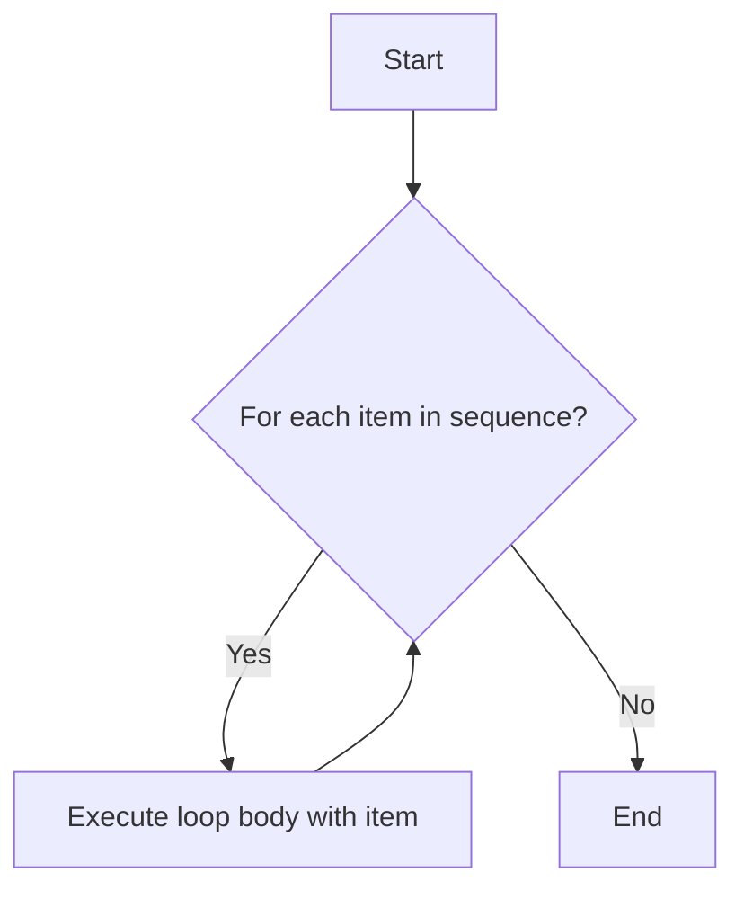

### List Comprehensions
List comprehensions provide a concise way to create lists. They consist of brackets containing an expression followed by a `for` clause:

```python
squares = [x**2 for x in range(10)]  # Generates a list of squares from 0 to 9
print(squares)  # Output: [0, 1, 4, 9, 16, 25, 36, 49, 64, 81]
```
### Real-World Applications
Control flow statements are used in various applications, such as:
- Decision-making processes in applications (e.g., user authentication).
- Data analysis workflows to filter and analyze datasets based on conditions.
- Game development for character movement and decision-making.
- Web development to handle user interactions and backend logic.

### Real-World Applications
Control flow statements are used in various applications, such as:
- Decision-making processes in applications (e.g., user authentication).
- Data analysis workflows to filter and analyze datasets based on conditions.
# Chapter 3: Control Flow

Control flow statements determine the order in which the instructions in a program are executed. Python provides several constructs for this, primarily `if/else` statements for conditional execution and `for`/`while` loops for repetitive tasks.

## 1. Conditional Statements (if, elif, else)
Conditional statements allow your program to make decisions based on certain conditions. Python uses `if`, `elif` (else if), and `else` keywords for this.

### Logical Operators (`and`, `or`, `not`)
To create more complex conditions, you can use logical operators:
*   `and`: Returns `True` if both conditions are true.
*   `or`: Returns `True` if at least one condition is true.
*   `not`: Reverses the boolean state of a condition.

```python
# Real-world example: Eligibility for a senior discount
age = 68
is_member = True
purchase_amount = 120.00

# Condition 1: Must be over 65 AND a member
if age >= 65 and is_member:
    print("Eligible for senior member discount!")

# Condition 2: Must be a member OR purchase over $100
if is_member or purchase_amount > 100:
    print("Eligible for loyalty bonus or large purchase discount.")

# Condition 3: Not a member (using 'not')
if not is_member:
    print("Consider becoming a member for more benefits.")

# Combined example: Free shipping conditions
# User must be premium OR purchase amount must be over 50
is_premium_user = False
order_total = 65.50

if is_premium_user or (order_total > 50 and not is_premium_user):
    print("Congratulations! You qualify for free shipping.")
else:
    print("Shipping fees apply. Spend more for free shipping!")
```

### Basic `if` Statement
The `if` statement executes a block of code only if a specified condition is true.

```python
age = 20

if age >= 18:
    print("You are an adult.")
```


### `if-else` Statement
The `if-else` statement executes one block of code if the condition is true and another block if the condition is false.

```python
age = 16

if age >= 18:
    print("You are an adult.")
else:
    print("You are a minor.")
```

```mermaid
graph TD
    A[Start]
    A --> B{Condition (age >= 18)?}
    B -- True --> C[Print("You are an adult.")]
    B -- False --> D[Print("You are a minor.")]
    C --> E[End]
    D --> E[End]
```

### `if-elif-else` Statement
Use `elif` when you have multiple conditions to check. This allows for a more complex decision-making process.

```python
score = 85

if score >= 90:
    print("Grade: A")
elif score >= 80:
    print("Grade: B")
elif score >= 70:
    print("Grade: C")
else:
    print("Grade: F")

# Real-world example: User access level
user_role = "admin"

if user_role == "admin":
    print("Full administrative access granted.")
elif user_role == "editor":
    print("Access to edit and publish content.")
elif user_role == "viewer":
    print("Read-only access to content.")
else:
    print("Unknown role. Access denied.")
```

Here's a flowchart representation of an `if-elif-else` statement:

```mermaid
graph TD
    A[Start]
    A --> B{score >= 90?}
    B -- Yes --> C[Print("Grade: A")]
    B -- No --> D{score >= 80?}
    D -- Yes --> E[Print("Grade: B")]
    D -- No --> F{score >= 70?}
    F -- Yes --> G[Print("Grade: C")]
    F -- No --> H[Print("Grade: F")]
    C --> I[End]
    E --> I
    G --> I
    H --> I
```

### Nested Conditional Statements
You can place `if` statements inside other `if` statements to handle more complex scenarios.

```python
weather = "sunny"
temperature = 28

if weather == "sunny":
    if temperature > 25:
        print("It's a hot and sunny day!")
    else:
        print("It's a pleasant sunny day.")
else:
    print("It's not sunny today.")

# Real-world example: Simple login system
valid_username = "user123"
valid_password = "pass456"

input_username = input("Enter username: ")
input_password = input("Enter password: ")

if input_username == valid_username:
    if input_password == valid_password:
        print("Login successful! Welcome.")
    else:
        print("Incorrect password.")
else:
    print("Invalid username.")
```

## 2. Getting User Input (`input()`)
Before diving into loops, let's briefly introduce how to get input from the user, which is often essential for interactive programs.

The `input()` function pauses your program and waits for the user to type something and press Enter. It always returns the user's input as a **string**.

```python
# Basic input example
user_name = input("Enter your name: ")
print(f"Hello, {user_name}!")

# Inputting numbers - remember to convert!
num1_str = input("Enter the first number: ")
num2_str = input("Enter the second number: ")

# Convert strings to integers or floats for calculations
num1 = int(num1_str) # or float(num1_str)
num2 = int(num2_str) # or float(num2_str)

sum_result = num1 + num2
print(f"The sum is: {sum_result}")
```

**Caution:** As seen in Chapter 2, if you try to convert a string that isn't a valid number to `int()` or `float()`, it will raise a `ValueError`.

## 3. Looping Statements (for, while)
Loops are used to execute a block of code repeatedly.

### `for` Loop
The `for` loop is used for iterating over a sequence (like a list, tuple, string, or range) or other iterable objects. It executes a block of code for each item in the sequence.

Here's a conceptual flowchart for a `for` loop:



#### Iterating over a List
```python
fruits = ["apple", "banana", "cherry"]
for fruit in fruits:
    print(fruit)

# Real-world example: Calculating total price of items in a shopping cart
shopping_cart = [10.99, 5.50, 20.00, 3.25]
total_price = 0
for item_price in shopping_cart:
    total_price += item_price
print(f"Total price of items: ${total_price:.2f}") # Output: Total price of items: $39.74
```

#### Iterating with `range()`
The `range()` function generates a sequence of numbers. It's commonly used to loop a specific number of times.

*   `range(stop)`: Generates numbers from 0 up to (but not including) `stop`.
*   `range(start, stop)`: Generates numbers from `start` up to (but not including) `stop`.
*   `range(start, stop, step)`: Generates numbers from `start` up to (but not including) `stop`, incrementing by `step`.

`range()` is efficient because it generates numbers on the fly rather than creating and storing a list of all numbers in memory, which is especially beneficial for very large sequences.

To see what `range()` generates, you can convert it to a list:
```python
print(list(range(5)))        # Output: [0, 1, 2, 3, 4]
print(list(range(2, 5)))     # Output: [2, 3, 4]
print(list(range(0, 10, 2))) # Output: [0, 2, 4, 6, 8]
print(list(range(5, 0, -1)))  # Output: [5, 4, 3, 2, 1] (counting down)
```

And here are examples of using `range()` in a `for` loop:
```python
# Loop 5 times (0 to 4)
for i in range(5):
    print(i)

# Loop from 2 to 4
for i in range(2, 5):
    print(i)

# Loop from 0 to 9, stepping by 2
for i in range(0, 10, 2):
    print(i)
```

#### Iterating with `enumerate()`
When you need both the index and the value while iterating over a sequence, `enumerate()` is very useful.

```python
fruits = ["apple", "banana", "cherry"]
for index, fruit in enumerate(fruits):
    print(f"Item at index {index}: {fruit}")
# Output:
# Item at index 0: apple
# Item at index 1: banana
# Item at index 2: cherry

# Real-world example: Displaying a leaderboard with ranks
players = ["Alice", "Bob", "Charlie", "David"]
scores = [1500, 1200, 1800, 900]

# To get a ranked list, we might sort first (covered in Chapter 2, but useful here)
# For simplicity, let's assume players are already ordered by score for this example
print("\n--- Leaderboard ---")
for rank, player in enumerate(players, start=1): # start=1 makes rank 1-indexed
    print(f"Rank {rank}: {player} (Score: {scores[rank-1]}) ") # Access score using adjusted index
# Output (assuming scores are already implicitly ordered with players):
# Rank 1: Alice (Score: 1500)
# Rank 2: Bob (Score: 1200)
# Rank 3: Charlie (Score: 1800)
# Rank 4: David (Score: 900)
```

#### Iterating with `zip()`
When you need to iterate over multiple sequences simultaneously, `zip()` is incredibly useful. It pairs up elements from each sequence.

```python
names = ["Alice", "Bob", "Charlie"]
ages = [25, 30, 35]

for name, age in zip(names, ages):
    print(f"{name} is {age} years old.")
# Output:
# Alice is 25 years old.
# Bob is 30 years old.
# Charlie is 35 years old.
# Output:
# Alice is 25 years old.
# Bob is 30 years old.
# Charlie is 35 years old.

# Real-world example: Pairing product details for inventory management
product_ids = ["P001", "P002", "P003"]
product_names = ["Laptop", "Mouse", "Keyboard"]
product_prices = [1200.00, 25.50, 75.00]

print("\n--- Product Inventory ---")
for pid, name, price in zip(product_ids, product_names, product_prices):
    print(f"ID: {pid}, Name: {name}, Price: ${price:.2f}")
# Output:
# ID: P001, Name: Laptop, Price: $1200.00
# ID: P002, Name: Mouse, Price: $25.50
# ID: P003, Name: Keyboard, Price: $75.00
```

### `while` Loop
The `while` loop repeatedly executes a block of code as long as a given condition is true.

```python
count = 0
while count < 5:
    print(count)
    count += 1 # Increment count by 1

# Real-world example: Simple retry mechanism
import time # Often used with retry logic

attempts = 0
max_attempts = 3
success = False

while attempts < max_attempts and not success:
    print(f"Attempt {attempts + 1} to connect...")
    # Simulate an attempt (e.g., trying to connect to a server)
    if attempts == 1: # Simulate success on the second attempt
        success = True
        print("Connection successful!")
    else:
        print("Connection failed. Retrying in 1 second...")
        time.sleep(1) # Pause for 1 second before retrying
    attempts += 1

if not success:
    print("Failed to connect after multiple attempts.")
```

**Caution:** Be careful with `while` loops to avoid infinite loops. Ensure that the condition eventually becomes false. The `time.sleep()` function is used here to simulate a delay, which is common in real-world retry mechanisms.

### Nested Loops
You can also nest loops, meaning one loop can be inside another. This is often used when working with multi-dimensional data structures like matrices or when you need to combine items from different lists.

```python
for i in range(1, 3):
    for j in range(1, 3):
        print(f"({i}, {j})")
# Output:
# (1, 1)
# (1, 2)
# (2, 1)
# (2, 2)

# Real-world example: Printing a multiplication table
print("\n--- Multiplication Table (1-3) ---")
for i in range(1, 4):
    for j in range(1, 4):
        print(f"{i} * {j} = {i * j}", end="\t") # Use tab for spacing
    print() # Newline after each row
# Expected Output:
# 1 * 1 = 1   1 * 2 = 2   1 * 3 = 3
# 2 * 1 = 2   2 * 2 = 4   2 * 3 = 6
# 3 * 1 = 3   3 * 2 = 6   3 * 3 = 9
```

### `else` with Loops (Optional Advanced Concept)
Both `for` and `while` loops can have an optional `else` block. This `else` block executes *only if the loop completes without encountering a `break` statement*.

```python
# Example with for-else
for i in range(3):
    print(f"For loop iteration: {i}")
else:
    print("For loop completed without break.")

# Example with while-else
count = 0
while count < 2:
    print(f"While loop iteration: {count}")
    count += 1
else:
    print("While loop completed without break.")

# Example where else does NOT execute (due to break)
for i in range(3):
    if i == 1:
        break
    print(f"For loop with break: {i}")
else:
    print("This will NOT be printed.")
```

## 3. Loop Control Statements

### `break` Statement
The `break` statement terminates the current loop and resumes execution at the statement immediately following the loop.

```python
for i in range(10):
    if i == 5:
        break
    print(i)
# Output: 0, 1, 2, 3, 4
```

### `continue` Statement
The `continue` statement skips the rest of the current iteration and moves to the next iteration of the loop.

```python
for i in range(5):
    if i == 2:
        continue
    print(i)
# Output: 0, 1, 3, 4 (2 is skipped)
```

### `pass` Statement
The `pass` statement is a null operation; nothing happens when it executes. It is useful as a placeholder when a statement is syntactically required but you don't want any code to execute.

```python
# This function does nothing yet, but avoids a syntax error
def coming_soon_function():
    pass

# In a conditional statement, if you don't want to do anything for a specific case
value = 10
if value > 5:
    pass
else:
    print("Value is 5 or less.")
```

In the next chapter, we will learn about functions, which allow you to organize your code into reusable blocks.

## Key Takeaways
*   Control flow statements (`if`, `elif`, `else`, `for`, `while`) determine the execution order of your program.
*   `if`, `elif`, `else` are used for conditional execution based on conditions.
*   Logical operators (`and`, `or`, `not`) combine or modify conditions.
*   `for` loops iterate over sequences (lists, strings, `range()`, `enumerate()`).
*   `while` loops repeat code as long as a condition is true.
*   `break` (terminates a loop) and `continue` (skips current iteration) are important loop control statements.
*   `pass` is a null operation placeholder.
*   Python uses indentation to define code blocks.
*   (Advanced) `for` and `while` loops can have an `else` block that executes if the loop completes normally.

## Exercise 3: Simple Calculator

Write a Python program that simulates a very basic calculator. It should:
1.  Take two numbers as input from the user.
2.  Take an operator as input (e.g., `+`, `-`, `*`, `/`).
3.  Use `if-elif-else` statements to perform the corresponding arithmetic operation.
4.  Print the result.

**Bonus:** Implement a check to prevent division by zero.

**Hint:** You'll need to use the `input()` function to get user input (which returns a string) and `float()` or `int()` to convert the input strings to numbers. Remember the `if-elif-else` structure for handling different operators.

**Example Interaction:**
```
Enter first number: 10
Enter operator (+, -, *, /): +
Enter second number: 5
Result: 15.0
```