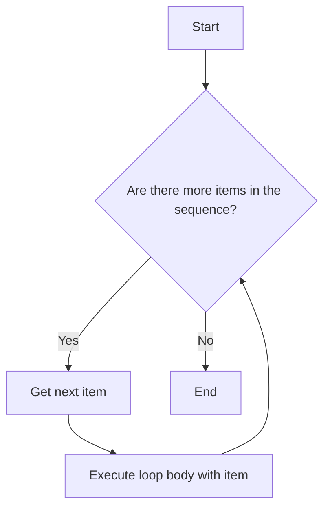

# Chapter 3: Control Flow

Control flow statements determine the order in which the instructions in a program are executed. Python provides several constructs for this, primarily `if/else` statements for conditional execution and `for`/`while` loops for repetitive tasks.

## 1. Conditional Statements (if, elif, else)
Conditional statements allow your program to make decisions based on certain conditions. Python uses `if`, `elif` (else if), and `else` keywords for this.

### Logical Operators (`and`, `or`, `not`)
To create more complex conditions, you can use logical operators:
*   `and`: Returns `True` if both conditions are true.
*   `or`: Returns `True` if at least one condition is true.
*   `not`: Reverses the boolean state of a condition.

```python
# Example with 'and'
age = 25
has_license = True

if age >= 18 and has_license:
    print("You can legally drive.")

# Example with 'or'
is_weekend = True
has_holiday = False

if is_weekend or has_holiday:
    print("It's a day off!")

# Example with 'not'
is_raining = False

if not is_raining:
    print("Let's go outside!")
```

### Basic `if` Statement
The `if` statement executes a block of code only if a specified condition is true.

```python
age = 20

if age >= 18:
    print("You are an adult.")
```

**Important:** Python uses indentation (whitespace at the beginning of a line) to define code blocks. This is crucial and different from many other languages that use curly braces `{}`.

### `if-else` Statement
The `if-else` statement executes one block of code if the condition is true and another block if the condition is false.

```python
age = 16

if age >= 18:
    print("You are an adult.")
else:
    print("You are a minor.")
```

Here's a flowchart representation of an `if-else` statement:

```
        +-------------------+
        | Start             |
        +--------+----------+
                 |
                 V
        +-------------------+
        | Condition (age >= 18)? |
        +---------+---------+
        |   True  |  False  |
        +---------+---------+
            |           |
            V           V
    +-----------+   +-----------+
    | Print("Adult")|   | Print("Minor")|
    +-----------+   +-----------+
            |           |
            +-----+-----+
                  |
                  V
        +-------------------+
        | End               |
        +-------------------+
```

### `if-elif-else` Statement
Use `elif` when you have multiple conditions to check. This allows for a more complex decision-making process.

```python
score = 85

if score >= 90:
    print("Grade: A")
elif score >= 80:
    print("Grade: B")
elif score >= 70:
    print("Grade: C")
else:
    print("Grade: F")
```

Here's a flowchart representation of an `if-elif-else` statement:

```
        +-------------------+
        | Start             |
        +--------+----------+
                 |
                 V
        +-------------------+
        | Condition 1 (score >= 90)? |
        +---------+---------+
        |   True  |  False  |
        +---------+---------+
            |           |
            V           V
    +-----------+   +-------------------+
    | Print("A")|   | Condition 2 (score >= 80)? |
    +-----------+   +---------+---------+
            |           |   True  |  False  |
            |           +---------+---------+
            |               |           |
            |               V           V
            |       +-----------+   +-------------------+
            |       | Print("B")|   | Condition 3 (score >= 70)? |
            |       +-----------+   +---------+---------+
            |               |           |   True  |  False  |
            |               |           +---------+---------+
            |               |               |           |
            |               |               V           V
            |               |       +-----------+   +-----------+
            |               |       | Print("C")|   | Print("F")|
            |               |       +-----------+   +-----------+
            |               |               |
            +-------+-------+-------+
                    |
                    V
        +-------------------+
        | End               |
        +-------------------+
```

### Nested Conditional Statements
You can place `if` statements inside other `if` statements to handle more complex scenarios.

```python
weather = "sunny"
temperature = 28

if weather == "sunny":
    if temperature > 25:
        print("It's a hot and sunny day!")
    else:
        print("It's a pleasant sunny day.")
else:
    print("It's not sunny today.")
```

## 2. Looping Statements (for, while)
Loops are used to execute a block of code repeatedly.

### Nested Loops
You can also nest loops, meaning one loop can be inside another. This is often used when working with multi-dimensional data structures like matrices or when you need to combine items from different lists.

```python
for i in range(1, 3):
    for j in range(1, 3):
        print(f"({i}, {j})")
# Output:
# (1, 1)
# (1, 2)
# (2, 1)
# (2, 2)
```

### `for` Loop
The `for` loop is used for iterating over a sequence (like a list, tuple, string, or range) or other iterable objects. It executes a block of code for each item in the sequence.

Here's a conceptual flowchart for a `for` loop:



#### Iterating over a List
```python
fruits = ["apple", "banana", "cherry"]
for fruit in fruits:
    print(fruit)
```

#### Iterating with `range()`
The `range()` function generates a sequence of numbers. It's commonly used to loop a specific number of times.

*   `range(stop)`: Generates numbers from 0 up to (but not including) `stop`.
*   `range(start, stop)`: Generates numbers from `start` up to (but not including) `stop`.
*   `range(start, stop, step)`: Generates numbers from `start` up to (but not including) `stop`, incrementing by `step`.

To see what `range()` generates, you can convert it to a list:
```python
print(list(range(5)))        # Output: [0, 1, 2, 3, 4]
print(list(range(2, 5)))     # Output: [2, 3, 4]
print(list(range(0, 10, 2))) # Output: [0, 2, 4, 6, 8]
```

And here are examples of using `range()` in a `for` loop:
```python
# Loop 5 times (0 to 4)
for i in range(5):
    print(i)

# Loop from 2 to 4
for i in range(2, 5):
    print(i)

# Loop from 0 to 9, stepping by 2
for i in range(0, 10, 2):
    print(i)
```

#### Iterating with `enumerate()`
When you need both the index and the value while iterating over a sequence, `enumerate()` is very useful.

```python
fruits = ["apple", "banana", "cherry"]
for index, fruit in enumerate(fruits):
    print(f"Item at index {index}: {fruit}")
# Output:
# Item at index 0: apple
# Item at index 1: banana
# Item at index 2: cherry
```

### `while` Loop
The `while` loop repeatedly executes a block of code as long as a given condition is true.

```python
count = 0
while count < 5:
    print(count)
    count += 1 # Increment count by 1
```

**Caution:** Be careful with `while` loops to avoid infinite loops. Ensure that the condition eventually becomes false.

### `else` with Loops (Optional Advanced Concept)
Both `for` and `while` loops can have an optional `else` block. This `else` block executes *only if the loop completes without encountering a `break` statement*.

```python
# Example with for-else
for i in range(3):
    print(f"For loop iteration: {i}")
else:
    print("For loop completed without break.")

# Example with while-else
count = 0
while count < 2:
    print(f"While loop iteration: {count}")
    count += 1
else:
    print("While loop completed without break.")

# Example where else does NOT execute (due to break)
for i in range(3):
    if i == 1:
        break
    print(f"For loop with break: {i}")
else:
    print("This will NOT be printed.")
```

## 3. Loop Control Statements

### `break` Statement
The `break` statement terminates the current loop and resumes execution at the statement immediately following the loop.

```python
for i in range(10):
    if i == 5:
        break
    print(i)
# Output: 0, 1, 2, 3, 4
```

### `continue` Statement
The `continue` statement skips the rest of the current iteration and moves to the next iteration of the loop.

```python
for i in range(5):
    if i == 2:
        continue
    print(i)
# Output: 0, 1, 3, 4 (2 is skipped)
```

### `pass` Statement
The `pass` statement is a null operation; nothing happens when it executes. It is useful as a placeholder when a statement is syntactically required but you don't want any code to execute.

```python
# This function does nothing yet, but avoids a syntax error
def coming_soon_function():
    pass

# In a conditional statement, if you don't want to do anything for a specific case
value = 10
if value > 5:
    pass
else:
    print("Value is 5 or less.")
```

In the next chapter, we will learn about functions, which allow you to organize your code into reusable blocks.

## Key Takeaways
*   Control flow statements (`if`, `elif`, `else`, `for`, `while`) determine the execution order of your program.
*   `if`, `elif`, `else` are used for conditional execution based on conditions.
*   Logical operators (`and`, `or`, `not`) combine or modify conditions.
*   `for` loops iterate over sequences (lists, strings, `range()`, `enumerate()`).
*   `while` loops repeat code as long as a condition is true.
*   `break` terminates a loop, `continue` skips the current iteration, and `pass` is a null operation placeholder.
*   Python uses indentation to define code blocks.
*   (Advanced) `for` and `while` loops can have an `else` block that executes if the loop completes normally.

## Exercise 3: Simple Calculator

Write a Python program that simulates a very basic calculator. It should:
1.  Take two numbers as input from the user.
2.  Take an operator as input (e.g., `+`, `-`, `*`, `/`).
3.  Use `if-elif-else` statements to perform the corresponding arithmetic operation.
4.  Print the result.

**Bonus:** Implement a check to prevent division by zero.

**Hint:** You'll need to use the `input()` function to get user input (which returns a string) and `float()` or `int()` to convert the input strings to numbers. Remember the `if-elif-else` structure for handling different operators.

**Example Interaction:**
```
Enter first number: 10
Enter operator (+, -, *, /): +
Enter second number: 5
Result: 15.0
```